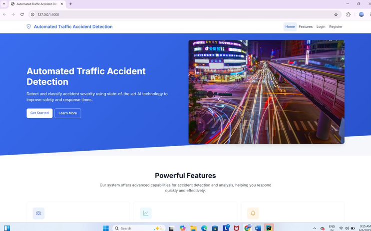
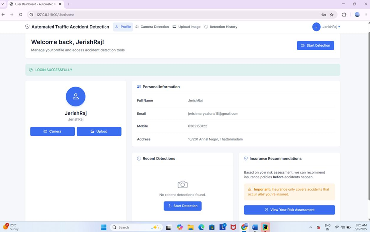
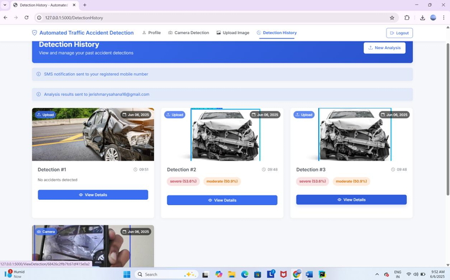
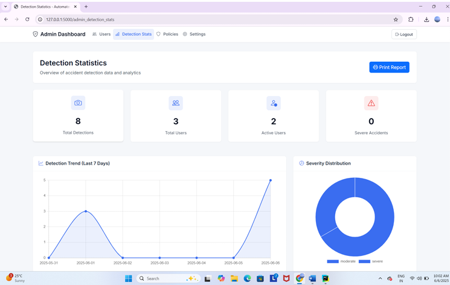
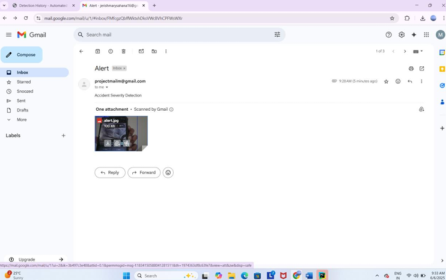

# 🚧 Automated Traffic Accident Detection and Alert System

This project is an AI-powered system for detecting road accidents in real-time and classifying their severity using the YOLOv8 deep learning model. It also integrates risk scoring, insurance policy recommendations, and alert mechanisms (email/SMS), all within a secure web application built using Flask and MongoDB.

---

## 📌 Features

- ✅ Accident detection using YOLOv8 object detection
- 🔥 Real-time webcam/image/video feed processing
- 📊 Severity classification: Minor, Moderate, Severe
- 📈 Risk scoring and dynamic policy suggestion
- 📤 Email/SMS notifications for severe cases
- 🧑‍💻 Admin dashboard to manage users and policies
- 🔒 User login/signup with secure session handling

---

## 🧠 Technologies Used

| Technology    | Purpose                                |
|---------------|----------------------------------------|
| YOLOv8        | Real-time object detection              |
| Flask         | Backend framework                      |
| HTML/CSS      | Frontend interface                     |
| Bootstrap     | Responsive web design                  |
| MongoDB       | NoSQL database for user/detection data |
| OpenCV        | Image and video processing             |
| SMTP/Twilio   | Sending email/SMS alerts               |

---

## 🚀 Installation

1. **Clone the repository**  
```bash
git clone https://github.com/your-username/accident-detection-system.git
cd accident-detection-system

**2.Create a virtual environment (recommended)**
python -m venv venv
source venv/bin/activate  # On Windows: venv\Scripts\activate

**3.Install dependencies**
pip install -r requirements.txt

**4.Configure MongoDB & Environment Variables**

Ensure MongoDB is running locally or use MongoDB Atlas.

Set up .env for sensitive data (API keys, DB URI, email credentials).

**5.Train or Load YOLOv8 Model**

Download or train a YOLOv8 model on your custom dataset.

Place best.pt in the model/ directory.

▶️ Running the Application
python app.py
Then open your browser and go to:
http://127.0.0.1:5000/

📁 Project Structure
accident-detection/
│
├── static/
│   └── uploads/, css/
├── templates/
│   └── *.html
├── model/
│   └── best.pt
├── app.py
├── Main.py
├── requirements.txt
└── README.md

🧪 Sample Use-Cases
🚨 Detect accidents from uploaded images or live webcam

📤 Alert admin and users during severe accidents

🧾 View detection history and personal risk level

📉 Admin assigns insurance policies based on risk


## 📷 Screenshots

### 🏠 Home Page  


### 👤 User Dashboard  


### ⚙️ Admin Dashboard  


### 📁 Detection History  


### 📊 Detection Statistics  


### 📧 Email Notification  



✅ Future Enhancements
🌍 GPS-based geolocation tracking

📱 Android/iOS mobile app

🎥 Multi-camera integration

🔗 Integration with police/emergency services API

👩‍💻 Author
JerishRaj – GitHub
Feel free to contribute, raise issues, or suggest improvements!
